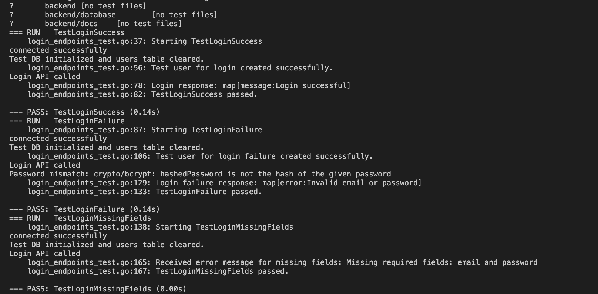

# Sprint 2 Report

**Project:** Gator-Club-Life 
**Frontend Team:** Abhigna Nimmagadda, Deekshita Kommi 
**Backend Team:** Sri Ashritha Appalchity, Sonali Karneedi

---

## 1. Implemented Secure Login Functionality

- **Database Update:**
  - Added a new password attribute to the users table.
- **User Registration API Update:**
  - Modified the registration endpoint to accept and securely store (hashed) passwords.
- **Login API Endpoint:**
  - Developed a new login endpoint to authenticate users, ensuring error responses are returned as JSON.

---

## 2. Migrated Backend from net/http to Fiber Framework

- Replaced Go’s built-in HTTP router with the Fiber framework.
- Rewrote endpoint handlers to use Fiber’s context for improved performance and maintainability.

---

## 3. Integrated Swagger for API Documentation

- Added Swagger annotations to backend endpoints.
- Configured the Fiber server to serve Swagger UI on `/swagger`, providing interactive API documentation.

---

## 4. Integrated Front-End & Back-End Login Functionality

- **Backend Adjustments:**
  - Configured the Fiber backend to support CORS for cross-origin requests.
  - Ensured the Login API endpoint is secure and returns consistent JSON responses.
- **Front-End Integration:**
  - Updated the Angular login component to call the Fiber Login API endpoint.
  - Integrated error handling and routing so that a successful login redirects the user to the home page.

---

## 5. Integrated Front-End & Back-End Register Functionality

- **Backend Adjustments:**
  - Updated the registration (CreateUser) API endpoint to handle password storage and return a clean response (omitting the password).
  - Enabled CORS on the backend to allow the Angular registration component to interact seamlessly.
- **Front-End Integration:**
  - Updated the Angular registration component to send a registration request to the backend.
  - Implemented proper validation (e.g., password confirmation) and error display in the front-end.

---

## 6. Backend Unit Tests for API Endpoints

- **Unit Tests for Users API Endpoints:**
  - Developed tests for fetching users, creating users (including handling invalid JSON, missing fields, and duplicate registration).
- **Unit Tests for Login API Endpoints:**
  - Developed tests for successful login, login failure (invalid credentials), and login with missing fields.
- **Test Structure:**
  - Tests were structured to maintain a 1:1 mapping with endpoint functions, ensuring comprehensive coverage.

---
## Unit Test Case Results:

### BACKEND
- Login API Unit Test Results

- Users API Unit Test Results

