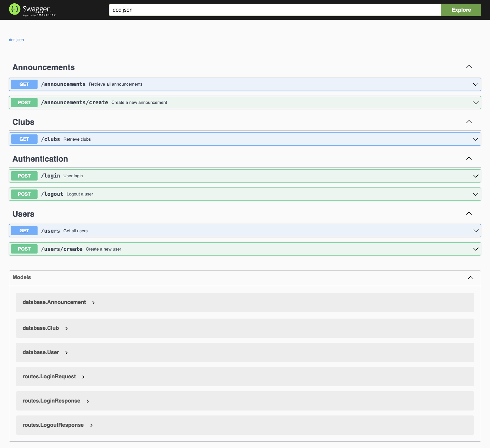
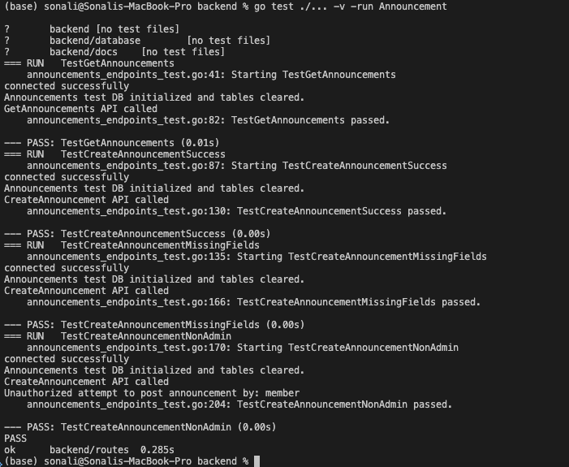
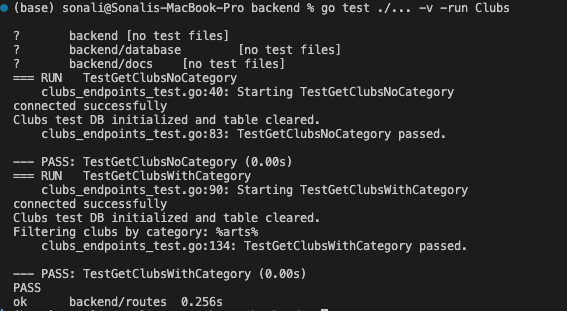
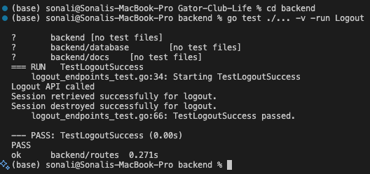
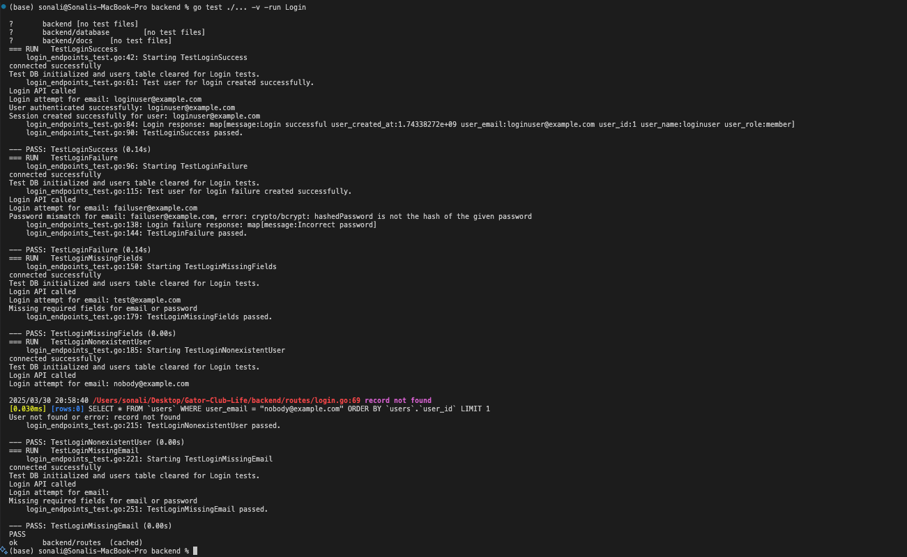
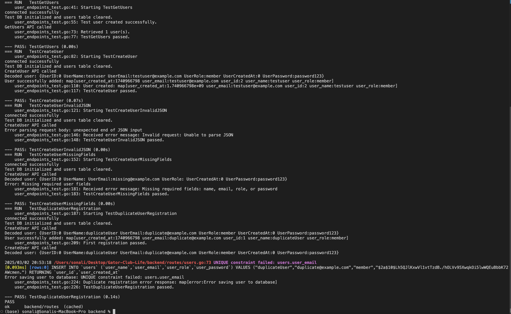

# Sprint 3 Report

**Project:** Gator-Club-Life 

**Frontend Team:** Abhigna Nimmagadda, Deekshita Kommi

**Backend Team:** Sri Ashritha Appalchity, Sonali Karneedi

### Videos
[Frontend and Backend](https://drive.google.com/drive/folders/1e_sp0JCpbC-Cb4-Nle8uBoK-_TgdPbhU?usp=sharing)

# Backend Documentation for Sprint 3

## Authentication & Sessions
- Implemented login using bcrypt for password verification.
- Created a session system using `fiber/session`.
- Added logout functionality to destroy sessions securely.
- Fully tested login and logout APIs with valid and invalid input.

## Clubs API

- Built the `/clubs` endpoint to fetch all club data.
- Added filtering by category (e.g., Academic, Health & Wellness).
- Updated the database schema with strict category validation.
- Connected frontend to dynamically retrieve club data.
- Unit tested all retrieval and filtering logic.

## Announcements System

- Created a new database table for announcements.
- Built `GET` and `POST` endpoints for announcements.
- Restricted `POST` to admin users only.
- Integrated frontend with backend for dynamic display.
- Tested successful creation, missing fields, and unauthorized access.

## API Documentation

- Integrated Swagger using Swaggo.
- Generated live API docs for login, logout, announcements, and clubs.
- Documentation accessible at `/swagger/*`.

## Testing
We wrote and executed unit tests for all major backend features.

### Announcements API
- `TestGetAnnouncements` — fetches all announcements.
- `TestCreateAnnouncementSuccess` — validates successful admin posting.
- `TestCreateAnnouncementMissingFields` — checks missing field handling.
- `TestCreateAnnouncementNonAdmin` — confirms role-based restriction.

### Clubs API
- `TestGetClubsNoCategory` — fetches all clubs.
- `TestGetClubsWithCategory` — validates category filter logic.

### Logout API
- `TestLogoutSuccess` — tests session termination on logout.

### Login API
- `TestLoginSuccess` — successful login with correct credentials.
- `TestLoginMissingFields` — login with missing fields returns error.
- `TestLoginNonExistingUser` — blocks login for nonexistent users.
- `TestLoginInvalidPassword` — invalid password is rejected.

### Users API
- `TestGetUsers` — fetches all users and checks for expected records.
- `TestCreateUser` — registers a new user and confirms the response omits the password field.
- `TestCreateUserInvalidJSON` — ensures malformed JSON is caught and returns a 400 error.
- `TestCreateUserMissingFields` — checks for proper error handling when required fields are missing.
- `TestDuplicateUserRegistration` — verifies that registering with an existing email is blocked.

---
# Frontend Doc:

## 1. Login Page Error Handling

- **Developed specific error messages** for login issues:
  - **'Invalid email address'** for incorrect email formats.
  - **'Invalid email or account not found'** for non-existent emails.
  - **'Incorrect password'** for wrong passwords.
- **Added email domain validation** to accept only **@ufl.edu** emails.
- **Updated the database** to remove non-UF emails and reset sequential user IDs for consistency.

---

## 2. Permits Component

- **Developed the Permits Component** to streamline the event permit submission process.
- **Features**:
  - A **welcome section** with instructions for users.
  - A **list of event types** for easy selection.
  - A **sidebar** to track progress through various permit stages (e.g., **Basic Information**, **Event Dates**).

---

## 3. Organization Details Page

- **Created the Organization Details Page** to display important information about an organization.
- **Features**:
  - A **sidebar** with the organization name, officers, and advisors.
  - A **main content section** with the organization’s purpose, announcements, and events.
- **Integrated dynamic data fetching** using Angular’s HttpClient service based on route parameters.

---

## 4. Dropdown Menu for Logged-In Users

- **Developed a dropdown menu** for logged-in users to access features like **Profile**, **Involvement**, **My Events**, **My Submissions**, and **Sign Out**.
- **Bug Fix**: Modified the mouseleave event to prevent the dropdown from closing prematurely, allowing it to stay open while interacting with the menu.

---

## 5. My Submissions Component

- **Developed the My Submissions Component** with three tabs:
  - **Org. Registrations**
  - **My Permits**
  - **Application Submissions**
- **Features**:
  - A **search/filter interface** in the **My Permits** tab for better organization of submissions.

---

## Testing

In addition to the development of core features, we performed unit testing for various components to ensure they function correctly in isolation.

### Unit Testing:
- **Login Page**: Validated error handling and email validation.
- **Permits Component**: Verified form submission and event type selection.
- **Organization Details Page**: Ensured dynamic data loading worked as expected.
- **Dropdown Menu**: Validated that the dropdown remained open while interacting with menu items.

### Tools Used:
- **Jasmine and Karma**: For unit testing individual components.

### Test Results:
- **25 test cases passed successfully**.
- All tests were conducted with **zero failures**.

Here’s a screenshot of the test results:

---

## Next Steps

- **UI/UX Enhancements**: Improve the design and responsiveness of the **Organization Details Page**.
- **Improve the UI/UX of Permits and Organizations**
- **Work on Issues in the next sprint**: resolve the step wise permit stage on My Permits Page.
- **Enhance Registration Form Validation**: Add input validation for more complex fields.

---

### **Sprint 4 Overview**

In Sprint 4, I will be focusing on improving and fixing a few issues in the **Permits Page** and enhancing the **layout of the Organizations View Page**. These tasks will ensure that the application is more intuitive and functional for users.

---

## Conclusion

With the addition of the **Login Page Error Handling**, **Permits Component**, and **My Submissions Component**, along with dynamic data fetching and bug fixes, we have significantly improved the user experience in this sprint. The successful completion of testing ensures the stability of the application, allowing us to confidently move forward with additional features in Sprint 4.

