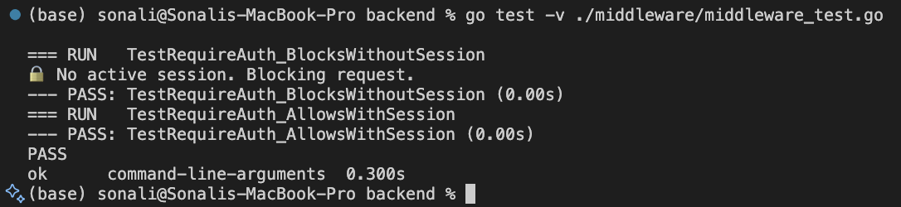
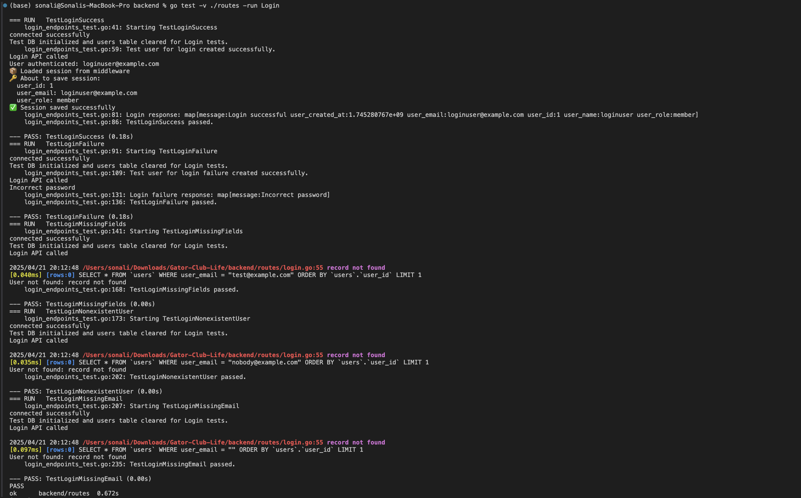
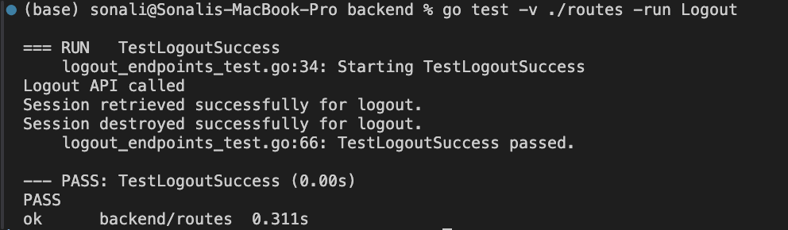
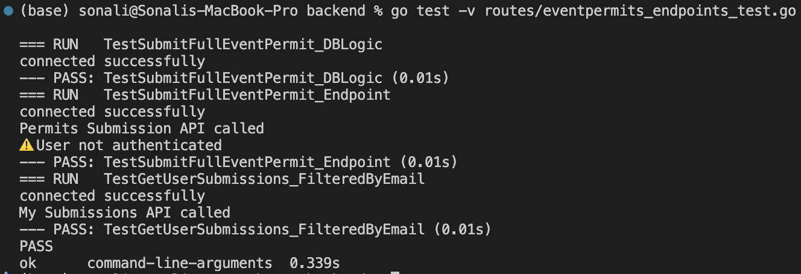
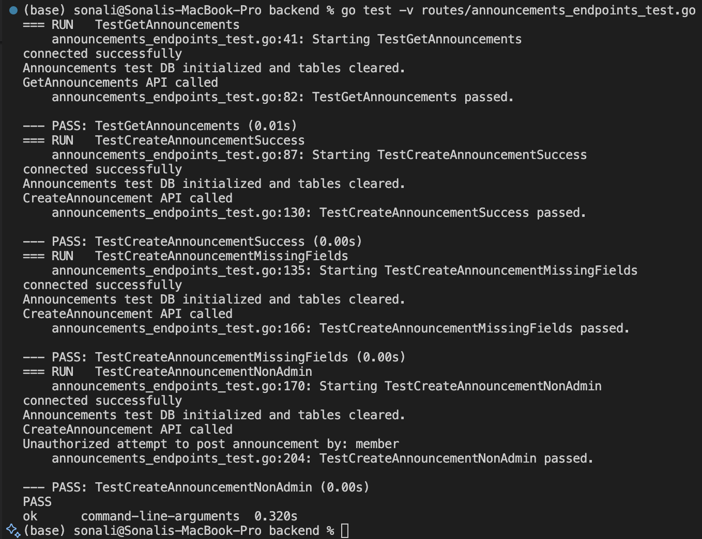
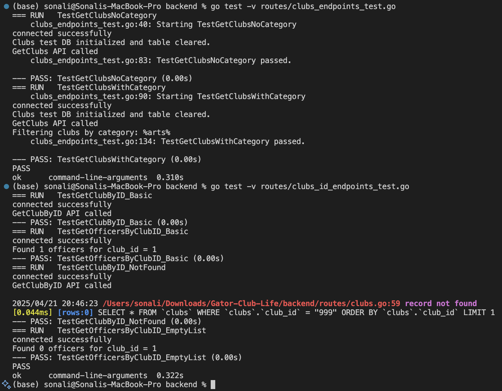
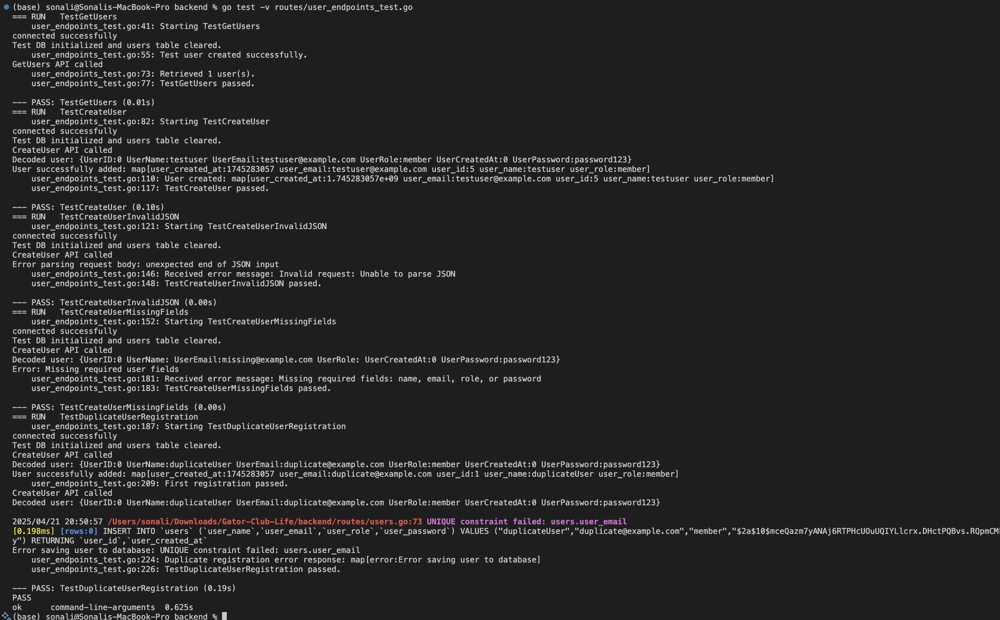

# Sprint 4 Report

**Project:** Gator-Club-Life 

**Frontend Team:** Abhigna Nimmagadda, Deekshita Kommi  
**Backend Team:** Sri Ashritha Appalchity, Sonali Karneedi

### Videos
[Frontend and Backend](https://drive.google.com/drive/folders/1Z7viHAD-hF8E0bMIbDpN7FGg0BqeDwxI?usp=sharing)

# Backend Documentation for Sprint 4

## Authentication & Session Management
- Implemented secure session destruction on backend restart to prevent stale session reuse.
- Ensured session persistence across server restarts using `fiber/session`.
- Extended login middleware to automatically associate `SubmittedBy` using active session data.
- Added full logout functionality to safely destroy sessions.
- Fully tested authentication flows with valid and invalid input cases.

## Event Permit Submission System
- Designed and implemented the full backend pipeline for event permit processing:
  - Defined comprehensive database schema for event permits, including nested slots and documents.
  - Built a single `/event-permits/submit` POST endpoint that accepts and stores full submission payloads.
  - Linked frontend to backend to ensure data flow from UI to database is seamless.
  - Connected user session data to submission payloads to track who submitted each permit.

## My Submissions Feature
- Added a new `MySubmissions` table to store user-specific submission data.
- Created APIs to retrieve submissions filtered by the authenticated user’s email.
- Connected frontend dashboard to display a logged-in user’s personal submissions dynamically.
- Ensured all submission tracking and filtering logic reflects the real-time database state.

## Organizations & Clubs Enhancements
- Built endpoints to:
  - Fetch a single organization by its ID.
  - Retrieve officers associated with a specific club.
- Integrated backend with the frontend to support dynamic organization detail pages.
- Improved announcement and club retrieval APIs with category and ID-based filtering.

## Announcements System Improvements
- Enhanced announcement APIs to:
  - Support admin-only creation via POST.
  - Filter announcements by club ID for better personalization.
- Connected frontend display logic with backend filters for real-time data updates.

## Sprint 4: Backend Unit Testing

### Goals of Sprint 4 Testing
The primary goal of unit testing in Sprint 4 was to:
- Ensure reliability and correctness of newly implemented backend features.
- Validate security and access control, especially around authentication and session-based data access.
- Detect and handle edge cases and error flows early.
- Build a scalable test foundation for future sprints with reusable utilities and seeded data.

### Test Structure & Strategy
All tests were organized into the following categories:
1. Middleware Tests – Validate access control logic.
2. Authentication Tests – Cover login and logout flows.
3. Event Permit Tests – Ensure correct storage, retrieval, and filtering.
4. Announcements Tests – Enforce role-based creation and validate filtering.
5. Clubs & Organizations Tests – Ensure accurate querying by ID or category.
6. User API Tests – Cover registration, validation, and duplication errors.

### Middleware Testing
- `TestRequireAuth_BlocksWithoutSession`  
  Confirms unauthorized access is blocked without a session.
- `TestRequireAuth_AllowsWithSession`  
  Grants access to authenticated users with valid sessions.

### Login & Logout API Testing
- `TestLoginSuccess` – Valid login with correct credentials.
- `TestLoginFailure` – Handles incorrect password.
- `TestLoginMissingFields` – Missing `email` or `password`.
- `TestLoginNonexistentUser` – User doesn't exist.
- `TestLoginMissingEmail` – Missing `email` field.
- `TestLogoutSuccess` – Confirms session destruction on logout.

### Event Permits Testing
- `TestSubmitFullEventPermit_DBLogic` – Validates full DB persistence.
- `TestSubmitFullEventPermit_Endpoint` – Endpoint request to DB response.
- `TestGetUserSubmissions_FilteredByEmail` – Retrieves session-specific submissions.

### Announcements Testing
- `TestGetAnnouncements` – Fetch all announcements.
- `TestCreateAnnouncementSuccess` – Admin-only creation.
- `TestCreateAnnouncementMissingFields` – Incomplete data triggers errors.
- `TestCreateAnnouncementNonAdmin` – Non-admin creation is blocked.

### Clubs Testing
- `TestGetClubsNoCategory` – No filter applied.
- `TestGetClubsWithCategory` – Valid category filter.
- `TestGetClubByID_Basic` – Valid ID retrieval.
- `TestGetClubByID_NotFound` – Invalid ID returns 404.
- `TestGetOfficersByClubID_Basic` – Retrieve officer list.
- `TestGetOfficersByClubID_EmptyList` – Handle no officers case.

### Users API Testing
- `TestGetUsers` – Fetch all users.
- `TestCreateUser` – Valid new user registration.
- `TestCreateUserInvalidJSON` – Handles malformed request.
- `TestCreateUserMissingFields` – Missing required fields.
- `TestDuplicateUserRegistration` – Prevents duplicates.

